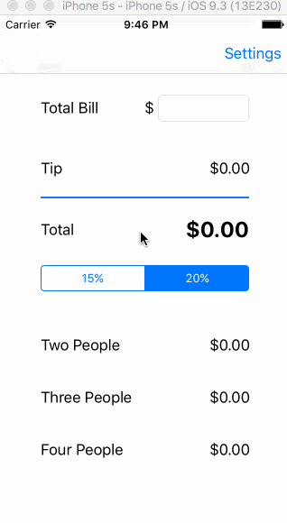

<h1>Pre-work - Tip Calculator</h1>

Submitted by: <b>Amarpreet  Johal</b>

Time spent: 10 hours

<h1>User Stories</h1>

The following required functionality is complete:

[ ] User can enter a bill amount, choose a tip percentage, and see the tip and total values.

[ ] User can see the amount split up between two, three and four people.

[ ] Settings page to change the default tip percentage and round up the total/tip.

#### GIF walkthrough

